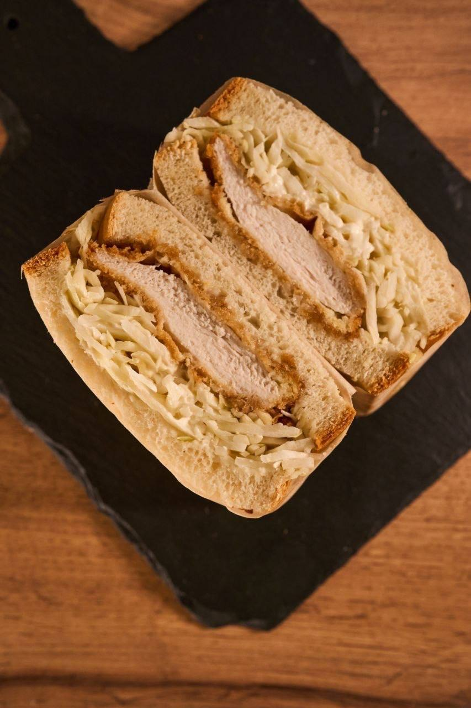

  
  <h1>🥪 Sando Sandwich</h1>
  
<strong>Сэндвичи для бизнеса. Надёжно, вкусно, вовремя.</strong>

  
Премиальное качество • Халяль • Вес 260–280 грамм

   
  <a href="https://thecashadam.github.io/SandoSandwich/">🌐 Посмотреть сайт</a>
  ·
  <a href="https://t.me/Magamadovd">📩 Заказать в Telegram</a>

 

<!-- БЕЙДЖИ -->

  
  
  

---

## 📖 О проекте

**Sando** — это B2B-поставщик сэндвичей премиум-качества. Мы работаем с кофейнями, компьютерными клубами, АЗС, кафе и магазинами, предоставляя вкусную и надёжную продукцию.

### Ключевые преимущества:

- ✅ **Премиальное качество** — свежие ингредиенты, отборное зерно
- ✅ **Халяль** — сертифицированная продукция
- ✅ **Вес 260–280 грамм** — сытно и питательно
- ✅ **Сертификаты ХАССП и Халяль** — подтверждённое качество
- ✅ **Доставка на следующий день** после заказа
- ✅ **Бесплатная доставка** от 3000 ₽
- ✅ **Дегустационный сет** — привезём бесплатно без обязательств

---

## 🍽️ Меню

| Сэндвич | Состав | Цена |
|---------|--------|------|
| **С КУРИЦЕЙ** | Куриное филе, салат, капуста, фирменный соус | 233 ₽ |
| **С РОСТБИФОМ** | Ростбиф, салат, томаты, огурцы, соус | 255 ₽ |
| **С ВЕТЧИНОЙ И ОМЛЕТОМ** | Омлет, ветчина, салат, огурцы, томаты, соус | 224 ₽ |
| **С ТУНЦОМ** | Тунец, яйцо, салат, огурцы, томаты, соус | 228 ₽ |
| **С ЯЙЦОМ** | Яичный салат, салат, огурцы, соус | 187 ₽ |
| **АНГЛИЙСКИЙ С РОСТБИФОМ** | Ростбиф, салат, томаты, огурцы, соус | 255 ₽ |
| **АЗИАТСКИЙ С КУРИЦЕЙ** | Куриное филе, корейская морковка, салат, соус | 240 ₽ |

---

## 📦 Условия доставки

- 🚚 Доставка **на следующий день** после заказа
- 🆓 **Бесплатная доставка** от 3000 ₽
- 💰 При заказе до 3000 ₽ — доставка 500 ₽
- 🏢 Работаем с: **АЗС, кафе, магазины, кофейни, компьютерные клубы**

### Наши клиенты:
- 🎮 Colizeum
- 🎧 RAVE by Buster
- И другие заведения Москвы

---

## 🎁 Дегустация

  <strong>🍽️ Попробуйте перед заказом!</strong> 
  Привезём дегустационный сет в ваше заведение — 
  <strong>бесплатно и без обязательств</strong>
    
  

---

## 📍 Контакты

- 📱 **Telegram для заказов:** [@Magamadovd](https://t.me/Magamadovd)
- 📍 **Адрес:** Чермянский проезд, д. 5, стр. 3
- 📅 **График работы:** Ежедневно
- 📦 **Доставка:** По Москве и области

---

## 🚀 Быстрый старт

Открой сайт в браузере:  
🔗 [https://thecashadam.github.io/SandoSandwich/](https://thecashadam.github.io/SandoSandwich/)

Или закажи напрямую в Telegram:  
📩 [@Magamadovd](https://t.me/Magamadovd)

---

## 🛠️ Используемые технологии

- **HTML5** — структура сайта
- **CSS3** — стили и адаптивность
- **JavaScript** — интерактивность
- **Font Awesome** — иконки
- **Google Fonts** — шрифты

---

## 📄 Лицензия

Этот проект распространяется под лицензией MIT — подробности см. в файле [LICENSE](LICENSE).

---

## 👤 Автор

**Adam**  
[GitHub](https://github.com/thecashadam) • [Telegram](https://t.me/Magamadovd)

---

© 2026 Sando Sandwich. Все права 
